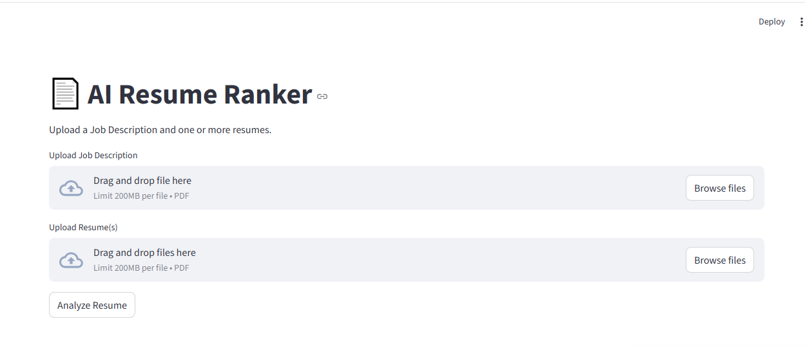
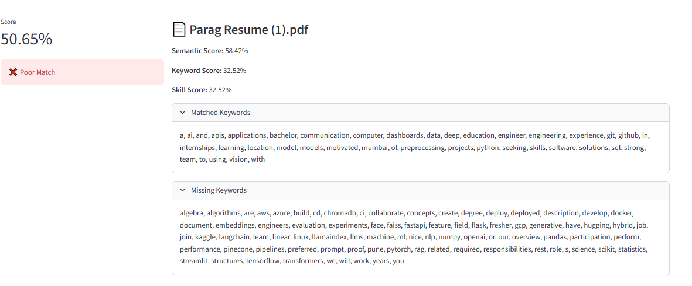
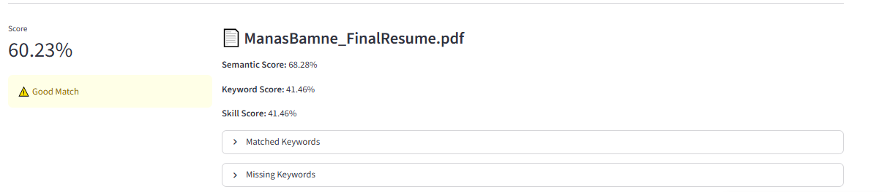

# AI Resume Ranker

This project is an AI-based Resume Ranker that compares resumes with a job description and ranks them based on how well they match. It uses semantic similarity, keyword matching, and skill analysis to provide an ATS-inspired score for each resume.

The goal of this project is to help recruiters quickly identify the most relevant candidates and help job seekers understand how well their resumes match a specific role.

## 🚀 Live Demo

**Try the application:**  
https://manas2904-ai-resume-ranker-app-6rw6zm.streamlit.app/

## Features

- **Semantic Analysis**: Uses sentence-transformers for deep semantic matching
- **Keyword Matching**: Extracts and matches keywords between resumes and job descriptions
- **Skill Extraction**: Identifies AI/ML specific skills from resumes
- **Smart Scoring**: Combines semantic, keyword, and skill scores for accurate ranking
- **Match Prediction**: Classifies resumes as Perfect Match, Good Match, or Poor Match
- **Detailed Analysis**: Shows matched/missing keywords for each resume
- Upload a Job Description (PDF)
- Upload multiple resumes
- Extract text from PDF files
- Compare resumes using semantic similarity
- Match keywords and technical skills
- Display overall ATS-inspired score
- Show matched and missing keywords
- Rank resumes based on relevance

## Screenshots







## Tech Stack

- Python
- Streamlit
- Sentence Transformers
- Scikit-learn
- Pandas
- NumPy
- PyPDF2

## How it Works

1. Upload a job description.
2. Upload one or more resumes.
3. The application extracts text from each document.
4. Semantic similarity is calculated between the resume and the job description.
5. Keywords and skills are matched.
6. A final score is generated and resumes are ranked.

## Project Structure

```
ai-resume-ranker/
│── app.py
│── requirements.txt
│── README.md
│── src/
│── images/
└── sample_data/
```

## Installation

Clone the repository

```bash
git clone https://github.com/Manas2904/ai-resume-ranker.git
```

Install the required packages

```bash
pip install -r requirements.txt
```

Run the application

```bash
streamlit run app.py
```

## Future Improvements

- Support DOCX resumes
- AI-based resume improvement suggestions
- Resume analytics dashboard
- Export reports as PDF
- Deploy the application online

## Author

**Manas**

Final Year B.Tech Artificial Intelligence & Machine Learning Student

GitHub: https://github.com/Manas2904


